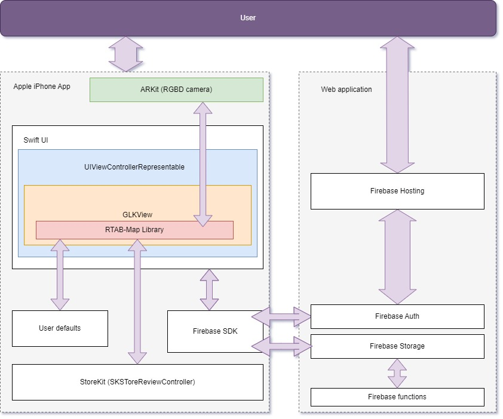
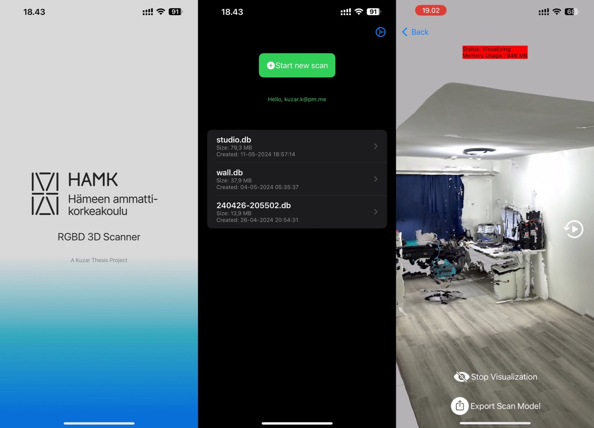
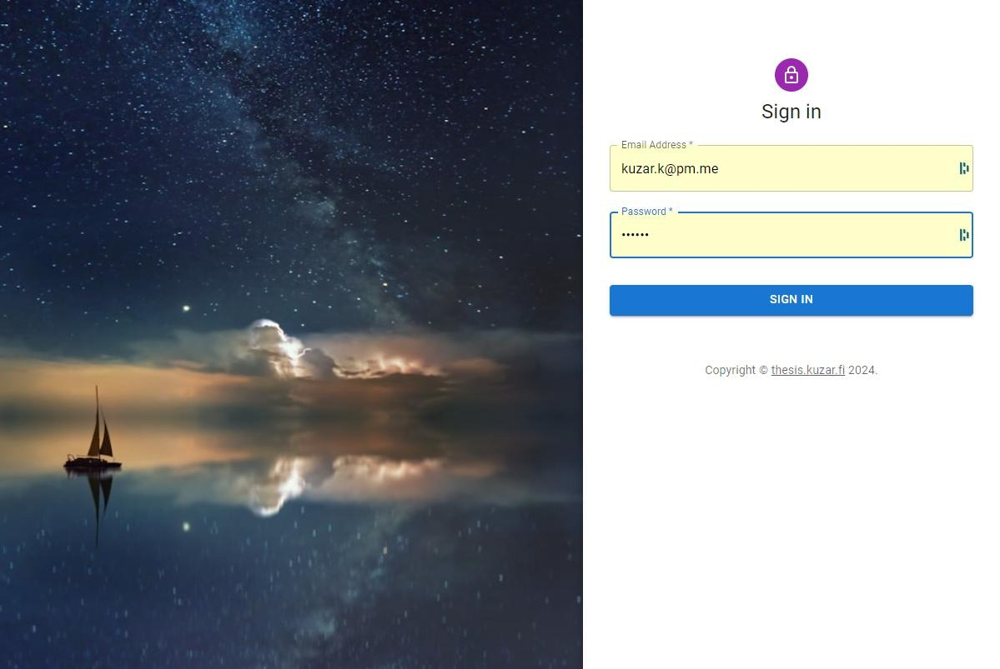
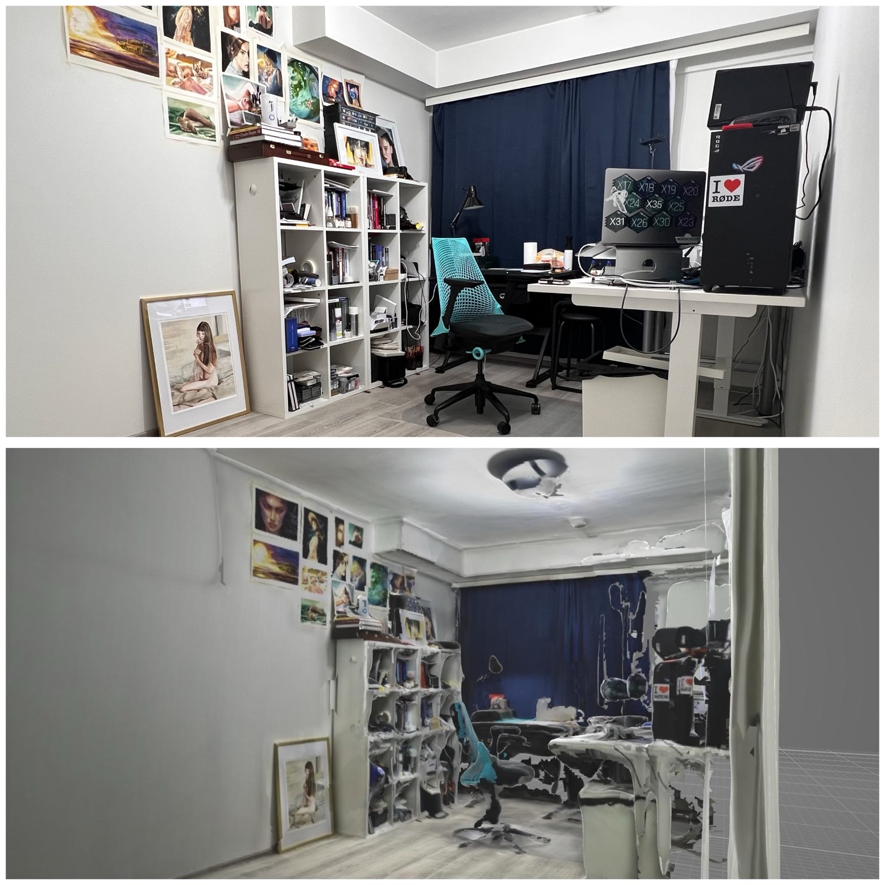
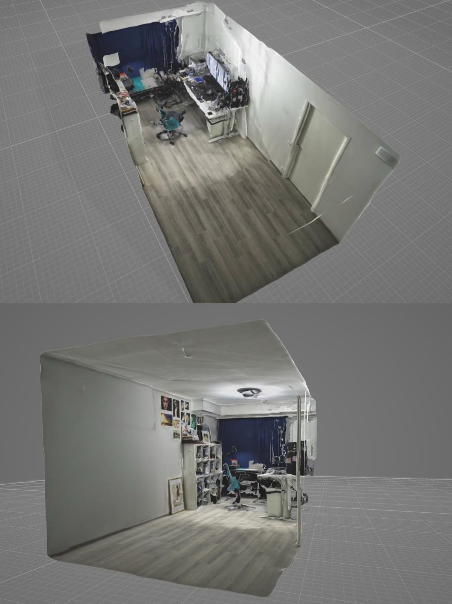

# Thesis project using RTAB-Map library to make a 3D reconstruction app utilizing iOS RGBD camera.

### Brief:
- This app is made for a thesis project. Link to the thesis [https://urn.fi/URN:NBN:fi:amk-2024053018592](https://urn.fi/URN:NBN:fi:amk-2024053018592)
- The `install_deps.sh` is made for compile and install all the cpp dependency to compile the RTAB-Map for the Xcode project.
- The project lack one Firebase config file, if you want to compile yourself, you need a firebase config `*.plist` file for it.
- If you interested, please watch this youtube video explain how this app works [https://youtu.be/0tDpO0bhFQw](https://youtu.be/0tDpO0bhFQw)

### Check the model:
Please go to [https://thesis.kuzar.fi/login](https://thesis.kuzar.fi/login) with username as `kuzar.k@pm.me` and password `123456`  (I know... I know....)

### Basic structure of the app:
> I am too lazy to explain this in detail in this README.md. More information is in the thesis itself.

### The layout of iOS app looks like:

### The layout of the webapp:

---
### The 3D reconstruction result:

---
